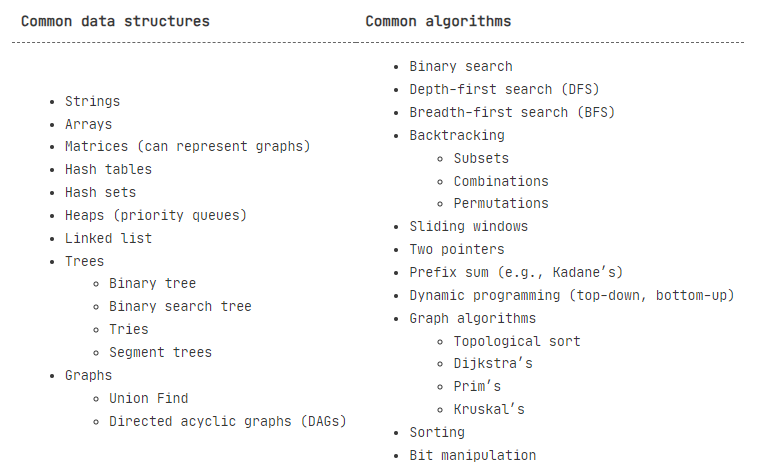
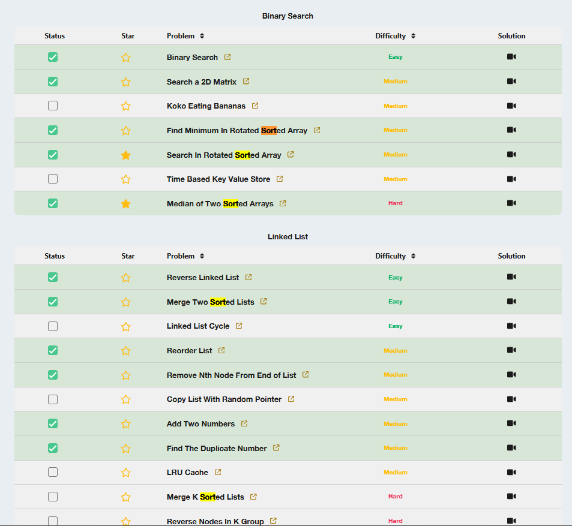
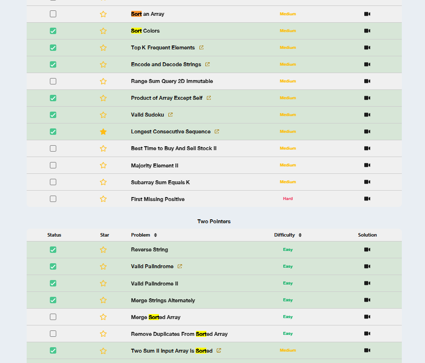
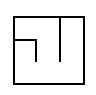

# Data Structures and Algorithm



## Table of Content
- [Data Structures and Algorithm](#data-structures-and-algorithm)
  - [Table of Content](#table-of-content)
  - [Status](#status)
  - [STACK 1](#stack-1)
    - [1. Array](#1-array)
    - [2. Hash](#2-hash)
    - [3. Strings](#3-strings)
    - [4. Sliding Window](#4-sliding-window)
    - [5. Sorting](#5-sorting)
    - [Binary Search](#binary-search)
  - [STACK 2](#stack-2)
    - [Trees](#trees)
    - [DFS and BFS](#dfs-and-bfs)
    - [Recursion (Backtracking, Graphs, DP and more)](#recursion-backtracking-graphs-dp-and-more)
      - [Problem Space of Permutations, Combinations, and Subsets](#problem-space-of-permutations-combinations-and-subsets)
    - [Heaps](#heaps)
    - [Dynamic Programming](#dynamic-programming)
  - [Time Complexity](#time-complexity)
    - [Log(N)](#logn)
  - [Python chits](#python-chits)
  - [CS Concepts](#cs-concepts)
  - [Resources to Read](#resources-to-read)
    - [Mathematics for DSA](#mathematics-for-dsa)
  - [Cheatsheet](#cheatsheet)
    - [Guide](#guide)
    - [Doubts](#doubts)
  - [Beginners Work](#beginners-work)
    - [Hacker Rank Solution](#hacker-rank-solution)
    - [Geek for Geek | Python Programming](#geek-for-geek--python-programming)
      - [1. Python Practise](#1-python-practise)
      - [2. Data Structures SDE sheet by love Babbar](#2-data-structures-sde-sheet-by-love-babbar)
## Status 

**Problems list resources**
* Neetcode.io 150 problems
* Leetcode daily 
* Leet code contest - Helpful [github repo](https://github.com/doocs/leetcode/blob/main/solution/CONTEST_README_EN.md#biweekly-contest-140)

**Answers**
* Intution for problem 
* Approach (which Data structure or  Algorithm?) and daigram
  * Edge cases
* Code flow design (pseudo code)
* write


**Pile ups 🥹**
- [ ] STACK1
- [ ] STACK2
- [ ] Subarray problems
- [ ] different type of sorting - merge sort, quick sort
- [ ] bit manipulations  daily and neet problems (contain contest prblm also)
- [ ] heaps daily and neet problems 
- [ ] backtraking neet problems
- [ ] dp1 revision and some neet problems
- [ ] dp1 string continue (11/10/24 contest of  problm - how to recognise it)
- [ ] Graphs 
- [ ] trie
- [ ] interval problem of neet and daily ques had heap approach check on that file

***More pending***
- [ ] trees notes
- [ ] greedy 
- [ ] excel complete (150 problems)

## STACK 1 
### 1. Array

   a. RAM (Random Access Memory)
   * Ram is Measured in bytes, 1 Byte = 8 bits and bit is a digit 0 or 1, so basically ram help to store the advance data sructure.
   * Integer stores in for of bytes, and 1 integer = 4 Bytes or 32 bits.
   * Ram 2 parts, Values and Address (Bytes). Ex Values: 1, 3, 5 and Its Adress: $0, $4 , $8.
   * Character takes only 1 byte (ASCII Characters).

   b. Arrays and its Properties
   
   **Static Array**
   * Array store in continous store of data
   * 2 parts: 
     * Reading(reach there using for loop to index)
     *  Writing (The size to be fixed, and operation is  `O(1)`). (this can be done easily by Index)
   * Disadvantage of Array (Static Array): . In Static araay you cannot delete the data, can only overwrite the values. *Not observed in python and Java
   * To put the value in middle, you have to move/shift every values in array on different array. (Cannot be done on same array)

   **Dynamic Array**
   * The problme solved here is fixed size and also here pusing, poping and shifiting at the end of the value, all will be `O(n)`
   * Here to get new array just mutiply it by earlier intizalise a new array.
   * We can deallocate the original array, when modifies the array.
   * Amortise Time Complexity will be `O(1)`.

   * Bit-O-Time of Static and Dynamic is same

   **Stacks**
   * Stack supports 3 operations Pop, Push and Peek/Top (Dynamcic array also have this)
   * Stack is also an array, Stack treats as vertical. (top is end kinda bucket)
   * Pop can happend only at the end (reversed way of pushed, pop goes like)
   * LIFO - Last In First Out DS.
   * Monotonic Increasing / Decreasing Based Questions
   * Stack Parenthesis Questions
   * Implementation-type Problems
   * Advanced Stack Problems (merge interval)
   * [General Approach to Stack Problems](https://leetcode.com/discuss/study-guide/3168516/A-general-approach-to-stack-problems-in-C%2B%2B-or-Generic-Template)

   **Prefix Sums**
   * In prefix, the values on which index we are including, we will consider value of that index + pre sum.
   * Example, to calculate the sum of subarray, Navie way will be `O(n)`. Using Prefix sum, in between values from (n to m) we can get the prefix of (m) - prefix of (n-1) its O(1).
   
   ``` python
   Class PrefixSum:
      def __init__(self,nums):
         self.prefix = []
         total = 0
         for n in nums:
            total += n
            self.prefix.append(total)
      
      def rangeSum(self, left, right):
         preRight = self.preficx[right]
         preLeft = self.prefix[left-1] if left >0 else 0
         return (preRight - preLeft)
   ```
   * handle this on extreme left on prefix

   **Two Pointers**
   * Two pointes example - Left and Right,  

  **Approaches from python**
   1. functions () \
         1.1. lambda function - its act like a function just a small version of def() `lambda x: x * 2` \
         1.2. map() - 
 
     
   
### 2. Hash

   **Hash Usage**
   * Hash Map is good with TC of `O(1)` in Insert, Remove and Search. But the biggest disadvantage is they don't have any order and their ordering on bases of Key TC is O(NlogN).
   * Use case of Hash Map: create dict type data store , then for loop and within it if consition if name is not in then dict. (python doesn't have special Hash thing so use dict) O(N)
   * [HashSets and HashTables in Python](https://www.askpython.com/python/examples/hashsets-and-hashtables-in-python)

 **Hashing**
   * Hash Table
   * [Python Hash() method](https://www.geeksforgeeks.org/python-hash-method/) 
   * Hash Map TC
 * 
   | Operation | Time Complexity |
   |-----------|-----------------|
   | search()  | O(1)            |
   | insert()  | O(1)            |
   | remove()  | O(1)            |

### 3. Strings

- `ord('c') - ord('a')`: to get the count number from s
- `char(97+number)`: to get the small letter and 65 for capital letters  
- list of words: can be sorted using : `sorted(words, key=len)`
- Some text book concepts for string matching:
  - *Knuth-Morris-Pratt (KMP)* 
  - *Rabin Karp*
- Next comes here is TrieNode if [solving](https://leetcode.com/problems/count-prefix-and-suffix-pairs-ii/) 

### 4. Sliding Window

* Sliding window is used to find the maximum/minimum subarray sum, subarray with
* [Sliding Window Technique: A Comprehensive Guide](https://leetcode.com/discuss/interview-question/3722472/mastering-sliding-window-technique-a-comprehensive-guide) - Leetcode

### 5. Sorting
* [Custom Sorting can be by functools cmp_to_key function in python](https://www.geeksforgeeks.org/how-does-the-functools-cmp_to_key-function-works-in-python/)
  * Sorting using function - solved questions in greedy notebook

- Using sorted function in string
  - When sorting the list strs = ["flower", "flow", "flight"] using the sorted() function, Python will sort the strings lexicographically (dictionary order).

  - Explanation:
The strings are compared character by character in order.
If the characters are equal, the next character is compared until a difference is found, or one string is exhausted.
For strs = ["flower", "flow", "flight"]:
 flight comes before flow because fli is lexicographically smaller than flo.
flow comes before flower because flow is a prefix of flower.
Result:
    ```python
    strs = sorted(["flower", "flow", "flight"])
    # Output:
    ['flight', 'flow', 'flower']
    ```


Watch : [Explaining EVERY Sorting Algorithm (part 1)](https://www.youtube.com/watch?v=AAwYzYkjNTg&t=4s)


1. Quick Sort
```python
class Solution:
    def partition(self, nums: List[int], left: int, right: int) -> int:
        mid = (left + right) >> 1
        nums[mid], nums[left + 1] = nums[left + 1], nums[mid]

        if nums[left] > nums[right]:
            nums[left], nums[right] = nums[right], nums[left]
        if nums[left + 1] > nums[right]:
            nums[left + 1], nums[right] = nums[right], nums[left + 1]
        if nums[left] > nums[left + 1]:
            nums[left], nums[left + 1] = nums[left + 1], nums[left]

        pivot = nums[left + 1]
        i = left + 1
        j = right

        while True:
            while True:
                i += 1
                if not nums[i] < pivot:
                    break
            while True:
                j -= 1
                if not nums[j] > pivot:
                    break
            if i > j:
                break
            nums[i], nums[j] = nums[j], nums[i]

        nums[left + 1], nums[j] = nums[j], nums[left + 1]
        return j

    def quickSort(self, nums: List[int], left: int, right: int) -> None:
        if right <= left + 1:
            if right == left + 1 and nums[right] < nums[left]:
                nums[left], nums[right] = nums[right], nums[left]
            return

        j = self.partition(nums, left, right)
        self.quickSort(nums, left, j - 1)
        self.quickSort(nums, j + 1, right)

    def sortArray(self, nums: List[int]) -> List[int]:
        self.quickSort(nums, 0, len(nums) - 1)
        return nums
```
Time & Space Complexity
* Time complexity: 
O
(
n
)
O(n) in average case, 
O
(
n
2
)
O(n 
2
 ) in worst case.
* Space complexity: 
O
(
log
⁡
n
)
O(logn) for recursive stack.
1. Merge Sort

```python
class Solution:
    def sortArray(self, nums: List[int]) -> List[int]:
        def merge(arr, L, M, R):
            left, right = arr[L : M + 1], arr[M + 1 : R + 1]
            i, j, k = L, 0, 0

            while j < len(left) and k < len(right):
                if left[j] <= right[k]:
                    arr[i] = left[j]
                    j += 1
                else:
                    arr[i] = right[k]
                    k += 1
                i += 1
            while j < len(left):
                nums[i] = left[j]
                j += 1
                i += 1
            while k < len(right):
                nums[i] = right[k]
                k += 1
                i += 1
        
        def mergeSort(arr, l, r):
            if l == r:
                return

            m = (l + r) // 2
            mergeSort(arr, l, m)
            mergeSort(arr, m + 1, r)
            merge(arr, l, m, r)
            return
        
        mergeSort(nums, 0, len(nums))
        return nums
```
Time & Space Complexity
- Time complexity: 
O
(
n
log
⁡
n
)
O(nlogn)
- Space complexity: 
O
(
n
)
O(n)
3. Heap Sort
```python
class Solution:
    def sortArray(self, nums: List[int]) -> List[int]:
        self.heapSort(nums)
        return nums
    
    def heapify(self, arr, n, i):
        l = (i << 1) + 1
        r = (i << 1) + 2
        largestNode = i
        
        if l < n and arr[l] > arr[largestNode]:
            largestNode = l
        
        if r < n and arr[r] > arr[largestNode]:
            largestNode = r
        
        if largestNode != i:
            arr[i], arr[largestNode] = arr[largestNode], arr[i]
            self.heapify(arr, n, largestNode)
    
    def heapSort(self, arr):
        n = len(arr)
        for i in range(n // 2 - 1, -1, -1):
            self.heapify(arr, n, i)
        
        for i in range(n - 1, 0, -1):
            arr[0], arr[i] = arr[i], arr[0]
            self.heapify(arr, i, 0)
```
Time & Space Complexity
* Time complexity: 
O
(
n
log
⁡
n
)
O(nlogn)
* Space complexity: 
O
(
log
⁡
n
)
O(logn) for recursive stack.
4. Counting Sort
```python
class Solution:
    def sortArray(self, nums: List[int]) -> List[int]:
        def counting_sort():
            count = defaultdict(int)
            minVal, maxVal = min(nums), max(nums)
            for val in nums:
                count[val] += 1

            index = 0
            for val in range(minVal, maxVal + 1):
                while count[val] > 0:
                    nums[index] = val
                    index += 1
                    count[val] -= 1

        counting_sort()
        return nums
```
Time & Space Complexity
- Time complexity: 
O
(
n
+
k
)
O(n+k)
- Space complexity: 
O
(
n
)
- Where 
n is the size of the array 
nums and 
k is the range between the minimum and maximum values in the array.

5. Radix Sort
```python
class Solution:
    def sortArray(self, nums: List[int]) -> List[int]:
        def countSort(arr, n, d):
            count = [0] * 10
            for num in arr:
                count[(num // d) % 10] += 1
            for i in range(1, 10):
                count[i] += count[i - 1]

            res = [0] * n
            for i in range(n - 1, -1, -1):
                idx = (arr[i] // d) % 10
                res[count[idx] - 1] = arr[i]
                count[idx] -= 1

            for i in range(n):
                arr[i] = res[i]

        def radixSort(arr):
            n = len(arr)
            max_element = max(arr)
            d = 1
            while max_element // d > 0:
                countSort(arr, n, d)
                d *= 10

        negatives = [-num for num in nums if num < 0]
        positives = [num for num in nums if num >= 0]

        if negatives:
            radixSort(negatives)
            negatives = [-num for num in reversed(negatives)]

        if positives:
            radixSort(positives)

        return negatives + positives
```
Time & Space Complexity
* Time complexity: 
O
(
d
∗
n
)
O(d∗n)
* Space complexity: 
O
(
n
)
O(n)
* Where 
n
n is the size of the array 
n
u
m
s
nums and 
d
d is the number of digits in the maximum element of the array.
6. Shell Sort
```python
class Solution:
    def sortArray(self, nums: List[int]) -> List[int]:
        def shell_sort(nums, n):
            gap = n // 2
            while gap >= 1:
                for i in range(gap, n):
                    tmp = nums[i]
                    j = i - gap
                    while j >= 0 and nums[j] > tmp:
                        nums[j + gap] = nums[j]
                        j -= gap
                    nums[j + gap] = tmp
                gap //= 2
        
        n = len(nums)
        if n == 1:
            return nums
        shell_sort(nums, n)
        return nums
```
Time & Space Complexity
- Time complexity: O(nlog⁡n) in average case, O(n^2) in worst case.
- Space complexity: O(1)


Target:


### Binary Search

## STACK 2 

### Trees

### DFS and BFS

### Recursion (Backtracking, Graphs, DP and more)

* [On Backtracking about Maze](https://sulugar1.tripod.com/games/maze/mazes.htm)
  * Unlike the simple recursion examples we had encountered, a backtracking procedure goes **through multiple winding and unwinding stages** as it loops through the choices it has to make at every node. 
  * One of the most common applications of backtracking is in the evaluation of moves for strategy games like chess. We will look at a much simpler game, tic-tac-toe, and see how a backtracking strategy can be used to ensure that we can never lose the game.
  * Maze 
     - 
  * You can use backtracking when you need to find all or some solutions to a problem that meets certain constraints, and the search space is too large or complex to use brute force or greedy methods. Backtracking is useful when: 
    * The problem involves exploring multiple possibilities 
    * You need to find all solutions or the best solution under constraints 
    * Choices must be made in sequence, and each choice depends on previous ones 
    * The solution to a problem does not have a time limit 
  * Backtracking is not regarded as an optimal problem-solving technique. It's not efficient for problems that have many solutions or require a lot of backtracking steps. In such cases, you may need to use other techniques. 
  * Backtracking can be used to solve problems such as Sudoku, N-queens, subset sum, and Hamiltonian cycle.

#### Problem Space of Permutations, Combinations, and Subsets

- **Permutations**: $( N! ) (for ( N )$ elements), generate all possible arrangements of elements.

- **Combinations**: $( C(N, k) = \frac{N!}{k!(N-k)!} )$ (choose \( k \) elements from \( N \)), focus on selecting a specific number of elements from a larger set.

- **Subsets**: $( 2^N )$ (since each element can either be included or excluded from the subset), generate all possible combinations of a set of elements (including the empty set).

* **Iterative, recursive/backtracking, and lexicographic generation (bitmasking)** are the three main strategies, each suited for different scenarios. [InDetail Read NoteBook](09.Backtracking.ipynb)


### Heaps
* 
   | Operation | Time Complexity |
   |-----------|-----------------|
   | top()     | O(1)            |
   | insert()  | O(log n)         |
   | remove()  | O(log n)         |
   | heapify() | O(n)            |
* adding value on heap in one go is `O(logn)`
* adding value on heap one a time (like thru some operations the value results) is `O(nlogn)`

### Dynamic Programming

* Fiboonacci number - instance of DP
  * convert Recusion to DP
  * While solving recusion problem, first approach brute force, then add memoization to it and second approach is bottom up.
  * True DP is Bottom up and partial considered memoization
  
* Approach to solve prblems Dynamic programming problem :
1. Check if we can create the decision tree
2. Check if we can create the memoization table
3. Use it for creating bottom up DP

Watch : [Mastering Dynamic Programming - How to solve any interview problem](https://www.youtube.com/watch?v=Hdr64lKQ3e4)

DP and Reinforcement Learning : [Medium List](https://medium.com/@numsmt2/list/reinforcement-learning-24c09d78a910)
   

## Time Complexity
* BiG O complexity - Run Time w.r.t to Input Size

   
   For More Read:
   * [Complexity Cheat Sheet for Python Operations](https://www.geeksforgeeks.org/complexity-cheat-sheet-for-python-operations/)
 
 Credits [NeetCode.io](https://neetcode.io/) &#10084;
  
  ### Log(N)

Code has **O(log(n))** time complexity when the number of operations decreases logarithmically as the size of the input, \( n \), increases. This typically happens when the input size is repeatedly divided by a constant factor in each step. Below are common scenarios where the time complexity is \( O(\log(n)) \):

1. **Binary Search**
   - **Scenario**: Searching for an element in a sorted array by dividing the search space into two halves at each step.
   - **Example**:
     ```python
     def binary_search(arr, target):
         left, right = 0, len(arr) - 1
         while left <= right:
             mid = (left + right) // 2
             if arr[mid] == target:
                 return mid
             elif arr[mid] < target:
                 left = mid + 1
             else:
                 right = mid - 1
         return -1
     ```
   - **Reason**: Each iteration cuts the problem size in half, leading to \( \log_2(n) \) steps.

2. **Balanced Binary Search Tree (e.g., AVL, Red-Black Trees)**
   - **Scenario**: Insertions, deletions, or lookups in a balanced binary search tree.
   - **Reason**: The height of the tree is \( O(\log(n)) \), so operations requiring traversal (like search or insert) scale logarithmically with the number of nodes.


3. **Heap Operations**
   - **Scenario**: Insertions or deletions in a binary heap (e.g., priority queue).
   - **Reason**: Adjustments (heapify-up or heapify-down) traverse the height of the heap, which is \( O(\log(n)) \).


4. **Exponentially Growing or Reducing Loops**
   - **Scenario**: A loop that doubles or halves a value in each iteration.
   - **Example**:
     ```python
     n = 100
     while n > 0:
         print(n)
         n //= 2
     ```
   - **Reason**: The loop runs approximately \( \log_2(n) \) times because \( n \) is halved at each step.


5. **Divide and Conquer Algorithms**
   - **Scenario**: Algorithms that split the problem into smaller subproblems in each step, but only solve one subproblem.
   - **Example**: Binary search, Euclid's algorithm for GCD.
   - **Reason**: The problem size reduces geometrically, leading to \( O(\log(n)) \) complexity.


6. **Iterative Algorithms with Exponential Growth**
   - **Scenario**: Doubling the counter or index variable in each iteration.
   - **Example**:
     ```python
     i = 1
     while i < n:
         print(i)
         i *= 2
     ```
   - **Reason**: The loop iterates \( \log_2(n) \) times because \( i \) grows exponentially.

 **Summary**
Any process that repeatedly divides or multiplies the input size by a constant factor is likely to have \( O(\log(n)) \) time complexity. Typical applications include:
- Search algorithms (e.g., binary search).
- Data structure operations (e.g., heaps, balanced trees).
- Divide and conquer strategies.
- Iterative loops with exponential growth or reduction.


## Python chits
* Itertool is a module provided by Python for creating iterators for efficient looping. It also provides various features or functions that work with iterators to produce complex iterators and help us to solve problems easily and efficiently in terms of time as well as memory. Itertools module provides us various ways to manipulate the sequence that we are traversing through. 
  *  Python – Itertools.[Permutations() ](https://www.geeksforgeeks.org/python-itertools-permutations/)


## CS Concepts
* https://tamerlan.dev/best-resources-to-teach-yourself-computer-science/


## Resources to Read 

* [ASCII Code Sheet](https://www.ascii-code.com/)
* [Binary Value Chart](https://www.oreilly.com/library/view/cisco-ccentccna-icnd1/9780133367843/app01.html)
* [Data Types in Python](https://docs.python.org/3/library/datatypes.html) : such as dates and times, fixed-type arrays, [heap queues](https://docs.python.org/3/library/heapq.html#heapq.heapify), double-ended queues, [collection](https://docs.python.org/3/library/collections.html) and enumerations.
* Book : 

### Mathematics for DSA
* [Maths for Data Structure and Algorithms (DSA) | A Complete Guide](https://www.geeksforgeeks.org/maths-for-data-structure-and-algorithms-dsa-a-complete-guide/) - GFG
* [Youtube: No One Gonna Tell You This 45 Math Topic For DSA](https://www.youtube.com/watch?v=dEXlNmD9baE)
  * [PDF - drive](https://drive.google.com/file/d/1_slu2SEIwD-NDdh60ns2KsnoSlxzVrWN/view?pli=1)
* [Youtube: Striver Math](https://www.youtube.com/watch?v=1xNbjMdbjug)
  
## Cheatsheet
* [Leetcode cheatsheet](https://leetcode.com/explore/interview/card/cheatsheets/720/resources/) - Good
* [Leetcode Course on Coding strategy](https://leetcode.com/explore/interview/card/coding-interview-strategy/206/chapter-1-the-interview-process/1349/)


### Guide 

* [LeetCode Patter by Sean prashad](https://seanprashad.com/leetcode-patterns/) -Good ques
* Striver Sheet 
* [Leetcode list by ML Engineer](https://leetcode.com/discuss/general-discussion/665604/important-and-useful-links-from-all-over-the-leetcode/659097) - Leetcode, [Medium Blog](https://mlengineer.io/common-leetcode-questions-by-categories-532b301130b)1 [Blog](https://mlengineer.io/from-semiconductor-to-software-engineer-8c3126dde65b)2
* [ML Engineer blog on Leetcode](https://mlengineer.io/common-leetcode-questions-by-categories-532b301130b)
* From <https://leetcode.com/discuss/career/807563/preparing-for-machine-learning-engineer-role-vs-software-engineer-role-in-india> 
* [Leecode FlowChart](https://algo.monster/flowchart) - AlgoMonster
* AlgoMonster dsa solutions - [GitHub1](https://github.com/das-jishu/algoexpert-data-structures-algorithms)
* [How I Mastered Data Structures and Algorithms](https://medium.com/algomaster-io/how-i-mastered-data-structures-and-algorithms-eb8c5273c56d) -Medium
* [TOPICS WHICH YOU CAN'T SKIP [INTERVIEW PREPARATION | STUDY PLAN] USING LEETCODE](https://leetcode.com/discuss/study-guide/1098600/TOPICS-WHICH-YOU-CAN'T-SKIP-INTERVIEW-PREPARATION-or-STUDY-PLAN-USING-LEETCODE) - 
* [14 Patterns to Ace Any Coding Interview Question](https://hackernoon.com/14-patterns-to-ace-any-coding-interview-question-c5bb3357f6ed) - Good
* [Interviewbit python questions basics](https://www.interviewbit.com/python-interview-questions/)
* [Practical Algorithms and Data Structures ](https://bradfieldcs.com/algos/) Skim Thru Topics site
* [Pirate LeetCode Resources](https://www.piratekingdom.com/leetcode/resources) -Site
* [DSA Master](https://instabyte.io/p/dsa-master)
* [Python for Algorithms, Data-Structures, and Interviews!](https://github.com/jmportilla/Python-for-Algorithms--Data-Structures--and-Interviews/tree/master) - Github Skim thru of code
* [From Zero To Hero in Data Structures & Algorithms](https://medium.com/@tushar_patil/how-to-prepare-for-dsa-zero-to-hero-53ee4b1e1ebd) - Medium
* [Big Companies and Startups Interview Questions](https://github.com/realabbas/big-companies-interview-questions) - Github
* [interactive-coding-challenges](https://github.com/donnemartin/interactive-coding-challenges) - Github
* https://medium.com/@siddhism/how-i-prepared-for-google-0-leetcode-questions-to-200-questions-e37690ebce85
* https://chingisoinar.medium.com/did-leetcode-help-me-get-a-job-in-ai-ml-2023-fd630fe7ea0f 


* [Python Cheat Sheet for Leetcode](https://leetcode.com/discuss/study-guide/2122306/Python-Cheat-Sheet-for-Leetcode)
* [Handy resources to lookup while coding](https://leetcode.com/discuss/interview-question/5942295/handy-resources-to-lookup-while-coding)

- [160 Coding Interview Questions | AlgoExpert](https://www.algoexpert.io/questions)
- [Problems — LeetCode](https://leetcode.com/problemset/all/?sorting=W3sic29ydE9yZGVyIjoiQVNDRU5ESU5HIiwib3JkZXJCeSI6IkRJRkZJQ1VMVFkifV0%3D) 

### Doubts
* [How to master edge cases?](https://www.reddit.com/r/leetcode/comments/17kkf9g/how_to_master_edge_cases/)- Reddit
* [Edge cases to consider during problem solving](https://leetcode.com/discuss/general-discussion/988504/Edge-cases-to-consider-during-problem-solving)
* [Corner cases and complete correctness - How to get better?](https://leetcode.com/discuss/general-discussion/1500557/corner-cases-and-complete-correctness-how-to-get-better)
* [How to learn leetcode patterns](https://www.reddit.com/r/csMajors/comments/zvszlr/how_to_learn_leetcode_patterns/)- Reddit
* [Guide: How to actually get good at leetcode](https://www.reddit.com/r/csMajors/comments/yvgor9/guide_how_to_actually_get_good_at_leetcode/) - Reddit


## Beginners Work

### Hacker Rank Solution
* [Notebook Link](https://drive.google.com/file/d/1F5lQiU5ruqgkJWTftnMlPQmhEyETKssf/view?usp=sharing)
* [Id](https://www.hackerrank.com/vg11072001)


### Geek for Geek | Python Programming 

#### 1. [Python Practise](https://www.geeksforgeeks.org/python-exercises-practice-questions-and-solutions/)
* [Notebook](https://colab.research.google.com/drive/1q1olHHQFaDAkNbFSJSQMv_hWt40udLWc#scrollTo=SGJBlQs3c3uq)

#### 2. [Data Structures SDE sheet by love Babbar](https://www.geeksforgeeks.org/dsa-sheet-by-love-babbar/)
* [Array Notebook](https://colab.research.google.com/drive/1N1bi6HQsA8gEKHt74EBNmsr8XK787JNo?usp=sharing) 
