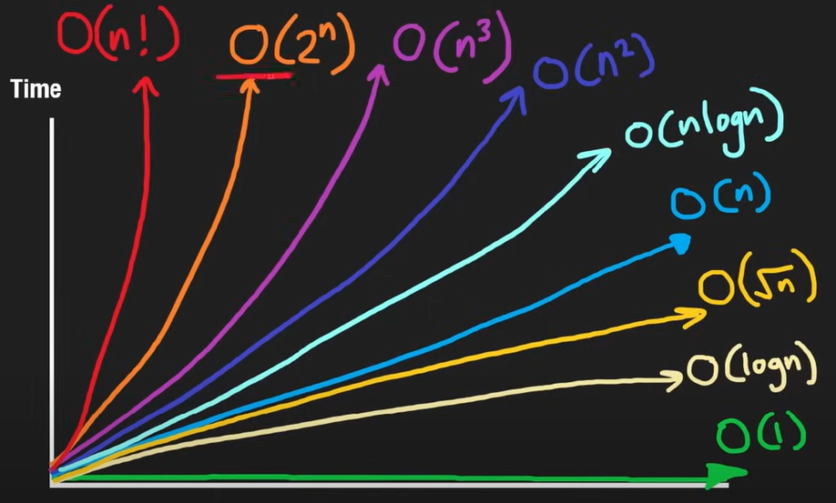

## Python Concepts for Data Structures and Algorithm
### 1. Array

   a. RAM (Random Access Memory)
   * Ram is Measured in bytes, 1 Byte = 8 bits and bit is a digit 0 or 1, so basically ram help to store the advance data sructure.
   * Integer stores in for of bytes, and 1 integer = 4 Bytes or 32 bits.
   * Ram 2 parts, Values and Address (Bytes). Ex Values: 1, 3, 5 and Its Adress: $0, $4 , $8.
   * Character takes only 1 byte (ASCII Characters).

   b. Arrays and its Properties
   
   **Static Array**
   * Array store in continous store of data
   * 2 parts: 
     * Reading(reach there using for loop to index)
     *  Writing (The size to be fixed, and operation is  `O(1)`). (this can be done easily by Index)
   * Disadvantage of Array (Static Array): . In Static araay you cannot delete the data, can only overwrite the values. *Not observed in python and Java
   * To put the value in middle, you have to move/shift every values in array on different array. (Cannot be done on same array)

   **Dynamic Array**
   * The problme solved here is fixed size and also here pusing, poping and shifiting at the end of the value, all will be `O(n)`
   * Here to get new array just mutiply it by earlier intizalise a new array.
   * We can deallocate the original array, when modifies the array.
   * Amortise Time Complexity will be `O(1)`.

   * Bit-O-Time of Static and Dynamic is same

   **Stacks**
   * Stack supports 3 operations Pop, Push and Peek/Top (Dynamcic array also have this)
   * Stack is also an array, Stack treats as vertical. (top is end kinda bucket)
   * Pop can happend only at the end (reversed way of pushed, pop goes like)
   * LIFO - Last In First Out DS.

   **Prefix Sums**
   * In prefix, the values on which index we are including, we will consider value of that index + pre sum.
   * Example, to calculate the sum of subarray, Navie way will be `O(n)`. Using Prefix sum, in between values from (n to m) we can get the prefix of (m) - prefix of (n-1) its O(1).
   
   ``` python
   Class PrefixSum:
      def __init__(self,nums):
         self.prefix = []
         total = 0
         for n in nums:
            total += n
            self.prefix.append(total)
      
      def rangeSum(self, left, right):
         preRight = self.preficx[right]
         preLeft = self.prefix[left-1] if left >0 else 0
         return (preRight - preLeft)
   ```
   * handle this on extreme left on prefix

   **Two Pointers**
   * Two pointes example - Left and Right,  

### My Notes on Array :eye:
   I'll be adding some rescoures and optimise function to use for better code:
   1. functions () \
         1.1. lambda function - its act like a function just a small version of def() `lambda x: x * 2` \
         1.2. map() - 
 
     
   
### 2. Hash

   **Hash Usage**
   * Hash Map is good with TC of `O(1)` in Insert, Remove and Search. But the biggest disadvantage is they don't have any order and their ordering on bases of Key TC is O(NlogN).
   * Use case of Hash Map: create dict type data store , then for loop and within it if consition if name is not in then dict. (python doesn't have special Hash thing so use dict) O(N)
   * [HashSets and HashTables in Python](https://www.askpython.com/python/examples/hashsets-and-hashtables-in-python)

 **Hashing**
   * Hash Table
   * [Python Hash() method](https://www.geeksforgeeks.org/python-hash-method/) 
   * Hash Map TC
 * 
   | Operation | Time Complexity |
   |-----------|-----------------|
   | search()  | O(1)            |
   | insert()  | O(1)            |
   | remove()  | O(1)            |
  

### Sliding Window

* Sliding window is used to find the maximum/minimum subarray sum, subarray with
* [Sliding Window Technique: A Comprehensive Guide](https://leetcode.com/discuss/interview-question/3722472/mastering-sliding-window-technique-a-comprehensive-guide) - Leetcode

### Sorting
* [Custom Sorting can be by functools cmp_to_key function in python](https://www.geeksforgeeks.org/how-does-the-functools-cmp_to_key-function-works-in-python/)

### Binary Search

### DFS and BFS

### Recursion (Backtracking, Graphs, DP and more)

### Heaps
* 
   | Operation | Time Complexity |
   |-----------|-----------------|
   | top()     | O(1)            |
   | insert()  | O(log n)         |
   | remove()  | O(log n)         |
   | heapify() | O(n)            |
* adding value on heap in one go is `O(logn)`
* adding value on heap one a time (like thru some operations the value results) is `O(nlogn)`

### Dynamic Programming

* Fiboonacci number - instance of DP
  * convert Recusion to DP
  * While solving recusion problem, first approach brute force, then add memoization to it and second approach is bottom up.
  * True DP is Bottom up and partial considered memoization
  
* Approach to solve prblems Dynamic programming problem :
1. Check if we can create the decision tree
2. Check if we can create the memoization table
3. Use it for creating bottom up DP
   

## Time Complexity
* BiG O complexity - Run Time w.r.t to Input Size

   

 Credits [NeetCode.io](https://neetcode.io/) &#10084;

## Resources to Read 

* [ASCII Code Sheet](https://www.ascii-code.com/)
* [Binary Value Chart](https://www.oreilly.com/library/view/cisco-ccentccna-icnd1/9780133367843/app01.html)
* Book : 

### Mathematics for DSA
* [Maths for Data Structure and Algorithms (DSA) | A Complete Guide](https://www.geeksforgeeks.org/maths-for-data-structure-and-algorithms-dsa-a-complete-guide/) - GFG
* [Youtube: No One Gonna Tell You This 45 Math Topic For DSA](https://www.youtube.com/watch?v=dEXlNmD9baE)
  * [PDF - drive](https://drive.google.com/file/d/1_slu2SEIwD-NDdh60ns2KsnoSlxzVrWN/view?pli=1)
* [Youtube: Striver Math](https://www.youtube.com/watch?v=1xNbjMdbjug)
  
## Cheatsheet
* [Leetcode cheatsheet](https://leetcode.com/explore/interview/card/cheatsheets/720/resources/) - Good
* [Leetcode Course on Coding strategy](https://leetcode.com/explore/interview/card/coding-interview-strategy/206/chapter-1-the-interview-process/1349/)


### Guide 

* [LeetCode Patter by Sean prashad](https://seanprashad.com/leetcode-patterns/) -Good ques
* Striver Sheet 
* [Leetcode list by ML Engineer](https://leetcode.com/discuss/general-discussion/665604/important-and-useful-links-from-all-over-the-leetcode/659097) - Leetcode, [Medium Blog](https://mlengineer.io/common-leetcode-questions-by-categories-532b301130b)1 [Blog](https://mlengineer.io/from-semiconductor-to-software-engineer-8c3126dde65b)2
* [ML Engineer blog on Leetcode](https://mlengineer.io/common-leetcode-questions-by-categories-532b301130b) 
* [Leecode FlowChart](https://algo.monster/flowchart) - AlgoMonster
* AlgoMonster dsa solutions - [GitHub1](https://github.com/das-jishu/algoexpert-data-structures-algorithms)
* [How I Mastered Data Structures and Algorithms](https://medium.com/algomaster-io/how-i-mastered-data-structures-and-algorithms-eb8c5273c56d) -Medium
* [TOPICS WHICH YOU CAN'T SKIP [INTERVIEW PREPARATION | STUDY PLAN] USING LEETCODE](https://leetcode.com/discuss/study-guide/1098600/TOPICS-WHICH-YOU-CAN'T-SKIP-INTERVIEW-PREPARATION-or-STUDY-PLAN-USING-LEETCODE) - 
* [14 Patterns to Ace Any Coding Interview Question](https://hackernoon.com/14-patterns-to-ace-any-coding-interview-question-c5bb3357f6ed) - Good
* [Interviewbit python questions basics](https://www.interviewbit.com/python-interview-questions/)
* [Practical Algorithms and Data Structures ](https://bradfieldcs.com/algos/) Skim Thru Topics site
* [Pirate LeetCode Resources](https://www.piratekingdom.com/leetcode/resources) -Site
* [Python Cheat Sheet for Leetcode](https://leetcode.com/discuss/study-guide/2122306/Python-Cheat-Sheet-for-Leetcode)
* [DSA Master](https://instabyte.io/p/dsa-master)
* [Python for Algorithms, Data-Structures, and Interviews!](https://github.com/jmportilla/Python-for-Algorithms--Data-Structures--and-Interviews/tree/master) - Github Skim thru of code
* [From Zero To Hero in Data Structures & Algorithms](https://medium.com/@tushar_patil/how-to-prepare-for-dsa-zero-to-hero-53ee4b1e1ebd) - Medium
* [Big Companies and Startups Interview Questions](https://github.com/realabbas/big-companies-interview-questions) - Github
* [interactive-coding-challenges](https://github.com/donnemartin/interactive-coding-challenges) - Github


ML Ques of Interview 
- [Github](https://github.com/Sindurav/CodingInterviews/tree/master/QuantumBlack%20Machine%20Learning%20Software%20Engineer%202019) 3 ques

### Doubts
* [How to master edge cases?](https://www.reddit.com/r/leetcode/comments/17kkf9g/how_to_master_edge_cases/)- Reddit
* [Edge cases to consider during problem solving](https://leetcode.com/discuss/general-discussion/988504/Edge-cases-to-consider-during-problem-solving)
* [Corner cases and complete correctness - How to get better?](https://leetcode.com/discuss/general-discussion/1500557/corner-cases-and-complete-correctness-how-to-get-better)
* [How to learn leetcode patterns](https://www.reddit.com/r/csMajors/comments/zvszlr/how_to_learn_leetcode_patterns/)- Reddit
* [Guide: How to actually get good at leetcode](https://www.reddit.com/r/csMajors/comments/yvgor9/guide_how_to_actually_get_good_at_leetcode/) - Reddit


## Beginners Work

### Hacker Rank Solution
* [Notebook Link](https://drive.google.com/file/d/1F5lQiU5ruqgkJWTftnMlPQmhEyETKssf/view?usp=sharing)
* [Id](https://www.hackerrank.com/vg11072001)


### Geek for Geek | Python Programming 

#### 1. [Python Practise](https://www.geeksforgeeks.org/python-exercises-practice-questions-and-solutions/)
* [Notebook](https://colab.research.google.com/drive/1q1olHHQFaDAkNbFSJSQMv_hWt40udLWc#scrollTo=SGJBlQs3c3uq)

#### 2. [Data Structures SDE sheet by love Babbar](https://www.geeksforgeeks.org/dsa-sheet-by-love-babbar/)
* [Array Notebook](https://colab.research.google.com/drive/1N1bi6HQsA8gEKHt74EBNmsr8XK787JNo?usp=sharing) 