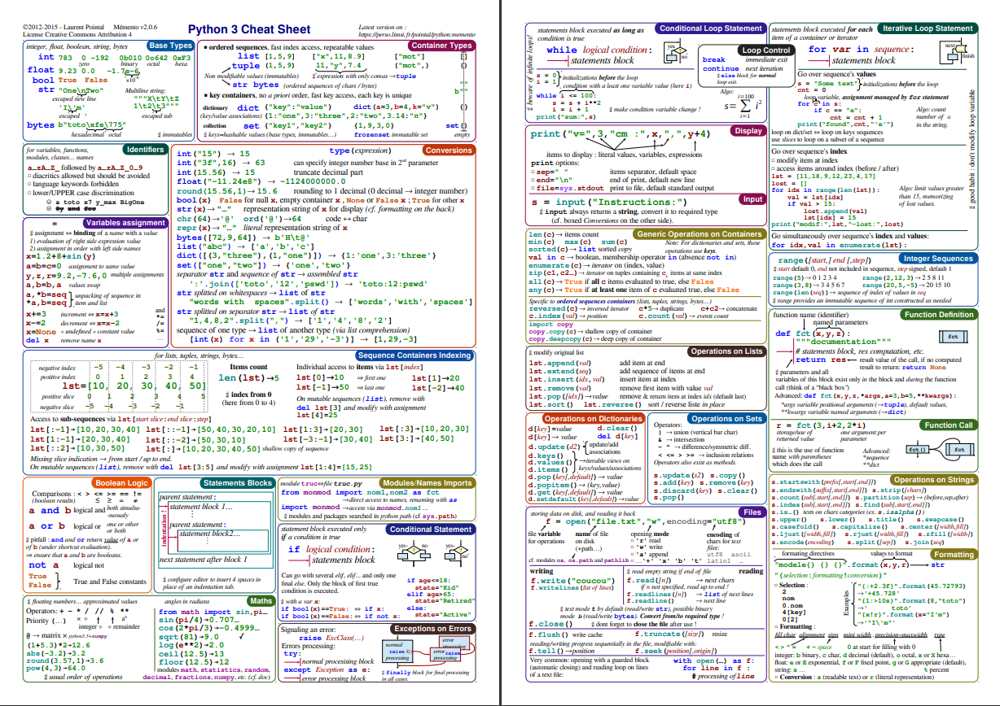
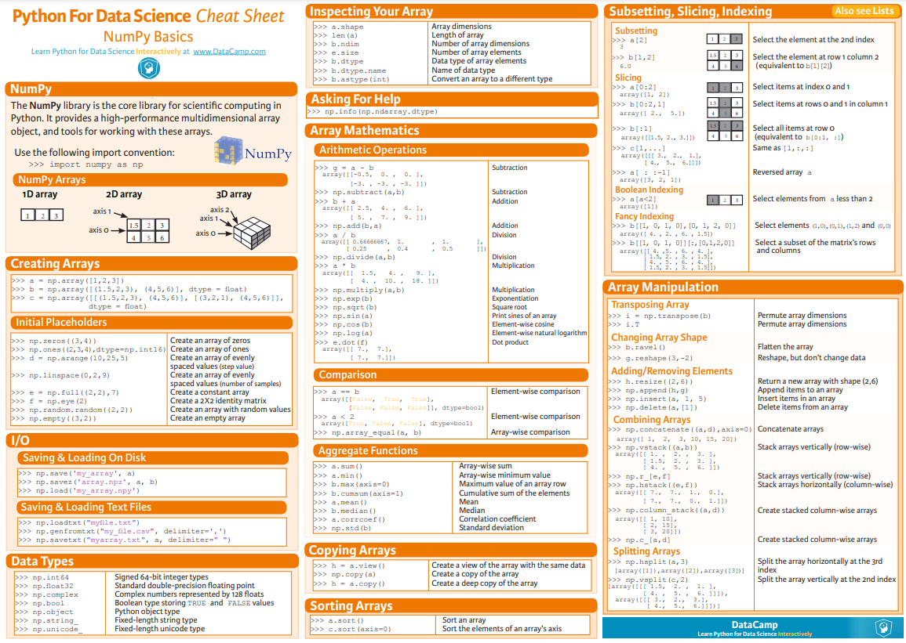

# Python Programming
Contain all resources, codes and problems solved be me of different platform

  
* [Automate the Boring Stuff with Python](https://automatetheboringstuff.com/): Online Book
* [Data Types in Python](https://docs.python.org/3/library/datatypes.html) : such as dates and times, fixed-type arrays, [heap queues](https://docs.python.org/3/library/heapq.html#heapq.heapify), double-ended queues, [collection](https://docs.python.org/3/library/collections.html) and enumerations.
* [Pandas](https://pandas.pydata.org/docs/reference/index.html) Reference API
* [NumPy](https://numpy.org/doc/stable/reference/index.html) Reference API, [InterviewBit](https://www.interviewbit.com/numpy-cheat-sheet/)

## Python Topics 
* Introduction 
* Control flows - statements, instructions, or function calls
* Data types - int, float, String, Tuple, List, Set and Dictionary
* Functions  
* Itertools module
* Comprehensions
* Manipulating strings
* String formatting
* Regular expressions
* Files and directory paths
* Reading and writing files
* Exception handling
* Debugging
* Args and Kwargs
* Main: top level script
* setup.py
* Dataclasses
* Virtual environments

ML python
* Numpy
  * Numpy Prcatice Questions - [Kaggle](https://www.kaggle.com/code/themlphdstudent/learn-numpy-numpy-50-exercises-and-solution)
  * Patterns - [Medium](https://medium.com/@kasperjuunge/numpy-10-most-common-usage-patterns-afc19f2fd7a)
* Pandas
  * Not to do -  [Blog](https://www.aidancooper.co.uk/pandas-anti-patterns/) 
  * Question - [GFG](https://www.geeksforgeeks.org/pandas-practice-excercises-questions-and-solutions/), [kaagle collection](https://www.kaggle.com/discussions/getting-started/119445), [More on Kaggle](https://www.kaggle.com/code/icarofreire/pandas-24-useful-exercises-with-solutions) 
* Matplotlib
* Seaborn
* bookeh


## Cheatsheets

* [Python Cheatsheet](https://www.pythoncheatsheet.org)
* [Comprehensive Python Cheatsheet](https://github.com/gto76/python-cheatsheet) - GitHub






## Data Structures and Alogirthm


```
If input array is sorted then
- Binary search
- Two pointers

If asked for all permutations/subsets then
- Backtracking

If given a tree then
- DFS
- BFS

If given a graph then
- DFS
- BFS

If given a linked list then
- Two pointers

If recursion is banned then
- Stack

If must solve in-place then
- Swap corresponding values
- Store one or more different values in the same pointer

If asked for maximum/minimum subarray/subset/options then
- Dynamic programming

If asked for top/least K items then
- Heap
- QuickSelect

If asked for common strings then
- Map
- Trie

Else
- Map/Set for O(1) time & O(n) space
- Sort input for O(nlogn) time and O(1) space
```

Full Guide: [Click Here](https://github.com/vg11072001/Python-programming/tree/main/DSA%20Python)


## Interesting articles on Python
* [Numerical Analysis & Statistics: MATLAB, R, NumPy](https://hyperpolyglot.org/numerical-analysis#numpy)
* [Python Pitfall: Mutable Default Arguments](https://towardsdatascience.com/python-pitfall-mutable-default-arguments-9385e8265422)
* [Interesting topic conver to Optimise python code](https://www.softformance.com/blog/how-to-speed-up-python-code/)
* [Hyperparameter Optimization in python](https://www.activestate.com/blog/top-10-tools-for-hyperparameter-optimization-in-python/)
* [How to write memory efficient classes in Python?](https://www.geeksforgeeks.org/how-to-write-memory-efficient-classes-in-python/)
* [Python Design Patterns](https://python-patterns.guide/)
* [Design Patterns in Python](https://refactoring.guru/design-patterns/python)